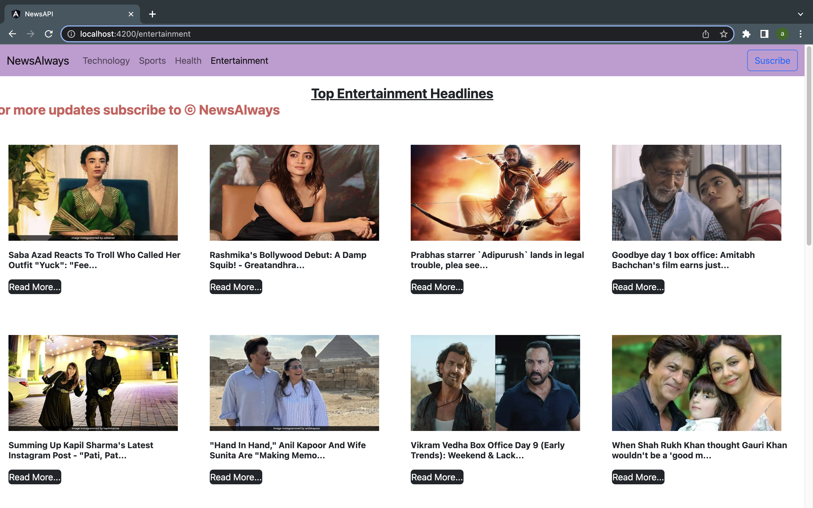

# NewsAPI

NewsAlways is a simple website which renders the data using API. It will show you the news about different field like sports, health, technology, etc.
This project was generated with [Angular CLI](https://github.com/angular/angular-cli) version 14.2.1. 

## Development server

Run `ng serve` for a dev server. Navigate to `http://localhost:4200/`. The application will automatically reload if you change any of the source files.

## Code scaffolding

Run `ng generate component component-name` to generate a new component. You can also use `ng generate directive|pipe|service|class|guard|interface|enum|module`.

## Build

Run `ng build` to build the project. The build artifacts will be stored in the `dist/` directory.

## Running unit tests

Run `ng test` to execute the unit tests via [Karma](https://karma-runner.github.io).

## Running end-to-end tests

Run `ng e2e` to execute the end-to-end tests via a platform of your choice. To use this command, you need to first add a package that implements end-to-end testing capabilities.

## Further help

To get more help on the Angular CLI use `ng help` or go check out the [Angular CLI Overview and Command Reference](https://angular.io/cli) page.

## Screenshots of Web Application
- Right click on the image and open in new tab, to see it clearly.

<table align="center">
<tr>
    <td>
   			NewsAlways Home Page
    </td>
     <td>
     		Technology related news
     </td>
</tr>
<tr>
     <td>
         
     	</td>
     	<td>
         
     	</td>
</tr>
<tr>
      <td>
     		  Sports related news
     	</td>
     	<td>
     			Health related news
     	</td>
</tr>
<tr>
     	<td>
     	</td>
     	<td>
     	</td>
</tr>
<tr>
      <td>
         Entertainment related news
      </td>
      <td>
         That's It
      </td>
</tr>
<tr>
     <td>
     </td>
     <td>
     </td>
     
</tr>

</table>
